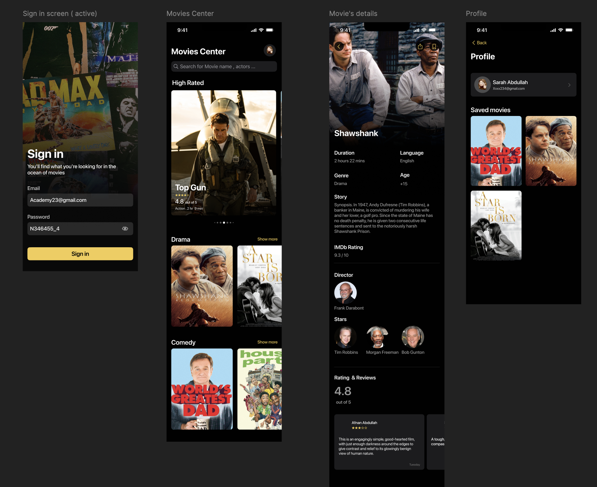

# Movies
An app that provides a way for movie lovers to view movies details and share them with their friends

# 🎬 Movieisme - Discover & Review Your Favorite Movies

**Movieisme** is a sleek and minimal mobile app built for movie lovers who enjoy browsing films, reading reviews, and sharing their opinions. The app provides an easy way to explore movie details, save favorites, and contribute personal reviews — all in one elegant place.

---

## 📱 Features

- 🔍 **Browse all movies** categorized by genre
- ✨ **View movie details**: title, poster, rating, runtime, cast, director, language, and synopsis
- 💬 **Write and read user reviews** for each movie
- 🔎 **Search** for a specific movie by name or actor
- 👤 **User profiles** with saved movies and account info
- 🔐 **Sign in** with email and password

---

## 🛠 Technologies Used

- **SwiftUI** – for the app interface and user interactions  
- **Movie Database API (TMDb)** – to fetch movie data  
- **Custom Components** – for cards, carousels, and modals  
- **Dark Mode Design** – elegant and easy on the eyes  

---
## 📸 Preview

Here's a glimpse of the app UI showcasing the sign-in screen, movie browsing, details view, and user profile:

---

## 🌍 App Statement

> *An app that provides a way for movie lovers to view movie details and share them with their friends.*

---

## 🚀 Future Enhancements

- Add support for trailers and watchlist reminders  
- Full bilingual interface (Arabic & English)

